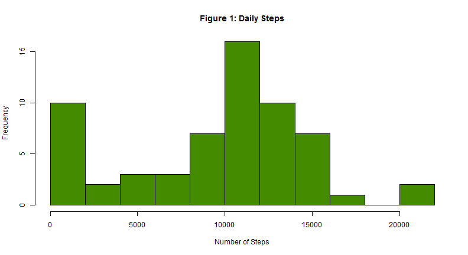
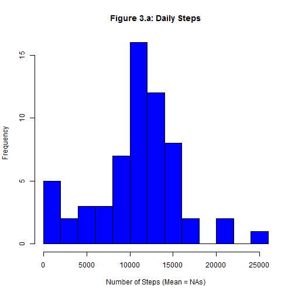
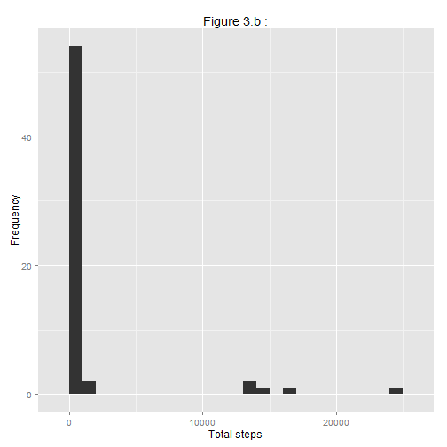
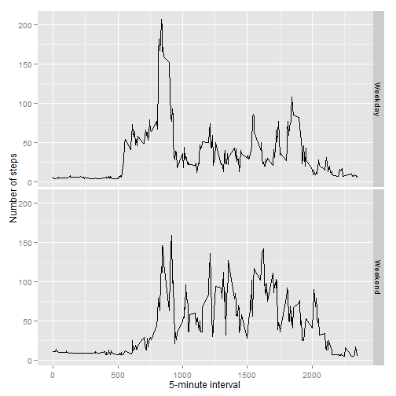

Reproducible Research Peer Assessment Assignment - Week #2
========================================================

# Introduction

With the advancement of technology and the growth of the **big data** movement, it is now possible to collect a large amount of data about personal movement using activity monitoring devices.  Such examples are: [Fitbit](http://www.fitbit.com/), [Nike Fuelband](http://www.nike.com/us/en_us/c/nikeplus-fuelband), or [Jawbone Up](https://jawbone.com/up). These kinds of devices are part of the "quantified self" movement: those who  measurements about themselves on a regular basis in order to improve their health,  find patterns in their behaviour, or because they are simply technology geeks. However, these data remain severely underused due to the fact that the raw data are hard to obtain and there is a lack of statistical methods and software for processing and interpreting the data.

This assignment makes use of data from a personal activity monitoring device. This device collects data at 5 minute intervals throughout the day. The data consists of two months of data from an anonymous individual collected during the months of October and November 2012 and include the number of steps taken in 5 minute intervals each day.

The overall goal of this assignment is to make some basic exploratory data analysis to assess some activity patterns with regards to the anonymous individual's walking patterns.  For each day, there are readings taken at particular 5-minute intervals.  These readings correspond to the number of **steps** taken by the anonymous individual between the previous 5-minute interval to the current 5-minute interval.

# Data Layout

These intervals are assigned a unique ID which corresponds to the interval taken at that day. 

As such, the data provided to us is a 3-column data frame:

1.  Column 1 - *steps*: Indicates the number of steps taken during a neighbouring 5-minute interval (between 5 minutes and 10 minutes, 10 minutes and 15 minutes, etc.).There was missing values maybe the cause was a failure in the gadget or the person was sleeping these are coded in as `NA` values.
2.  Column 2 - *date*:  Indicates the date at which the measurement was taken.  This is in the `YYYY-MM-DD` format.
3.  Column 3 - *interval*: The aforementioned ID that determines at which 5-minute interval the reading was taken at (5, 10, 15, 20, etc.)

# Procedure

## Preamble

There are five steps overall in our analysis:

1.  Loading in and preprocessing the data
2.  Plotting a histogram of the total number of steps taken each day and calculating the mean and median of each day.
3.  Determining the average daily activity pattern: Plotting a time-series plot for each 5-minute interval (the x-axis) with the average number of steps averaged across all days (the y-axis).
4.  Imputing missing values: There were some instances where the amount of steps read for an interval were missing.In this step, a simple strategy was performed to replace the missing values in the dataset with a filler value.  This value was chosen to be the **mean within the 5-minute interval the value was missing for**.  
5.  The last part of the analysis is to split up the data into weekdays and weekends and observe if there is any difference in activity patterns between these two classes.  The same kind of plot is repeated like in Step #3, but now there are two separate plots to reflect the activity on the weekdays and weekends.

## Loading librarys and preprocessing data

We need to set our working directory (where there is the .csv data) with the `setwd()` function.
 What we will do is unarchive the `.zip` file and read the data in using `read.csv()` and in the parameters putting the claasses column´s (numeric,date and numeric).


```r
#reading data  
nike_data <- read.csv( unzip("activity.zip"),
                sep=",",
                na.strings = "NA",
                colClasses =c("numeric","Date","numeric"))
```
Now we load the libraries.

```r
library(ggplot2)
library(plyr)
library(lattice)
library(knitr)
library(lubridate)
```
## What is the mean total number of steps taken per day?

First, let's plot a histogram of the total number of steps taken for each day. Before we do this, we will create an object that accumulates the steps. We will also calculate what the mean and median number.


```r
# Create a histogram of the total number of steps taken
# each day
# Next find the total number of steps over each day
step_day <- tapply(nike_data$steps,nike_data$date,function(x) sum(x,na.rm=TRUE))
# Plot a Histogram
hist(step_day, breaks = 15, col="chartreuse4",xlab="Number of Steps", main="Figure 1: Daily Steps")
```

 

The mean steps per day are:


```r
#Mean total number of steps taken per day:
step_mean <-mean(step_day, na.rm = T)
step_mean
```

```
## [1] 9354.23
```

The median steps per day are:

```r
#Median total number of steps taken per day:
steps_median<- median(step_day,na.rm=TRUE)
steps_median
```

```
## [1] 10395
```

## What is the average daily activity pattern?
1.Time series plot (i.e. type = "l" ) of the 5-minute interval (x-axis) and the average number of steps taken, averaged across all days (y-axis)
2.It is imperative to note that we again will ignore `NA` values.
3.Which 5-minute interval, on average across all the days in the dataset, contains the maximum number of steps?


```r
#aggregating mean
steps_pattern <- aggregate(nike_data$steps ~ nike_data$interval, nike_data, FUN=mean, na.rm=T)
#putting names 
names(steps_pattern) <- c("interval","average_steps")
#plotting
xyplot(steps_pattern$average_steps ~ steps_pattern$interval, 
       type = "l", ylab = "Average Number of Steps", 
       xlab ="5-minute Interval",
       main = "Figure 2: Time Series Plot", lwd = 2)
```

 

With reference to the above plot, the interval that records the maximum number of steps averaged across all days is:


```r
max_steps <- which.max(steps_pattern$average_steps)
max_steps
```

```
## [1] 104
```

## Imputing missing values

1.Calculate and report the total number of missing values in the dataset (i.e. the total number of rows with `NA`s).
First, let's calculate the total number of missing values there are.  This denotes the total number of observations that did not have any steps recorded (i.e. those rows which are `NA`)


```r
sum(is.na(nike_data$steps))
```

```
## [1] 2304
```

2.Devise a strategy for filling in all of the missing values in the dataset.

The strategy does not need to be sophisticated. For example, you could use the mean/median for that day, or the mean for that 5- minute interval, etc
The strategy that we will use to fill in the missing values in the data set is to replace all `NA` values with the mean of that particular 5-minute interval the observation falls on.  Now that we have devised this strategy, let's replace all of the `NA` values with the aforementioned strategy.


```r
sub_nas <- nike_data[is.na(nike_data),]
sub_nas$steps <- merge(steps_pattern, sub_nas)$average_steps
```
3.Create a new dataset that is equal to the original dataset but with the missing data filled in.

```r
# create the new dataset 
nike_data_fill <- nike_data
nike_data_fill[is.na(nike_data),] <- sub_nas
daily_steps_fill <- tapply(nike_data_fill$steps,nike_data_fill$date,function(x) sum(x,na.rm=TRUE))
```
4.Now that this is finished, let's plot a histogram of the new data:


```r
hist(daily_steps_fill, breaks = 15, col="blue",xlab="Number of Steps (Mean = NAs)", main="Figure 3.a: Daily Steps")
```

 

```r
qplot(daily_steps_fill-step_day, binwidth = 1000, xlab='Total steps', ylab='Frequency',main="Figure 3.b :")
```

 


## Are there differences in activity patterns between weekdays and weekends?

The dataset with the filled-in missing values is used. 
1. A new factor variable is created in the dataset with two levels - "weekday" and "weekend" indicating whether a given date is a weekday or weekend day. 
2. A panel plot containing a time series plot (i.e. type = "l" ) of the 5-minute interval (x-axis) and the average number of steps taken is constructed, averaged across all weekday days or weekend days (y-axis).


```r
daytype <- function(date) {
        if (weekdays(as.Date(date)) %in% c("sábado", "domingo")) {
                "Weekend"
        } else {
                "Weekday"
        }
}
nike_data_fill$daytype <- as.factor(sapply(nike_data_fill$date, daytype))
nike_data_fill$day <- sapply(nike_data_fill$date, FUN = daytype)

averages <- aggregate(steps ~ interval + day, data = nike_data_fill, mean)
ggplot(averages, aes(interval, steps)) + geom_line() + facet_grid(day ~ .) + 
    xlab("5-minute interval") + ylab("Number of steps")
```

 
